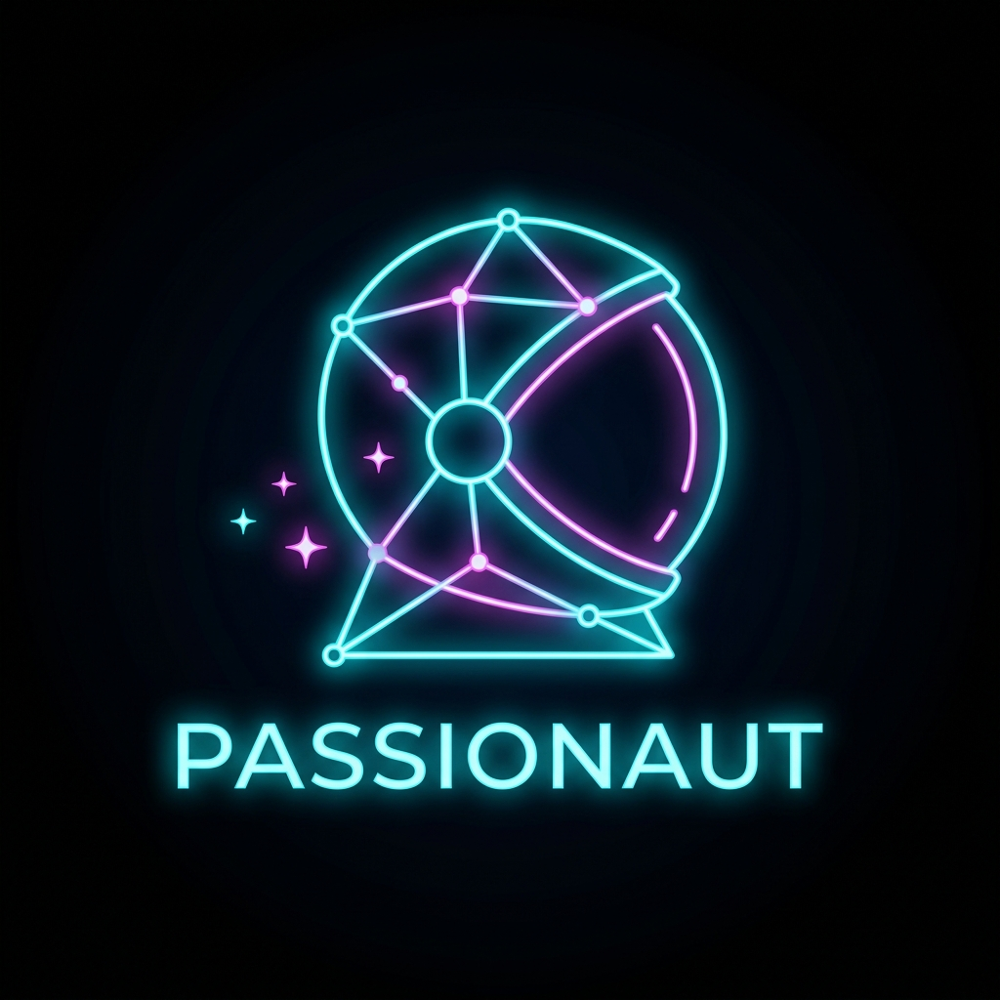
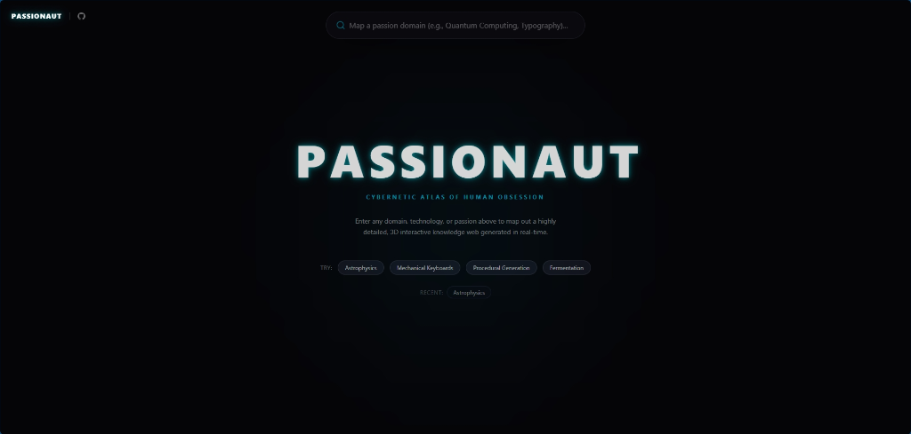
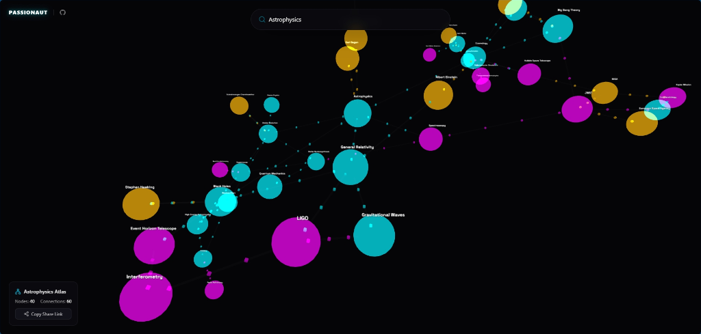
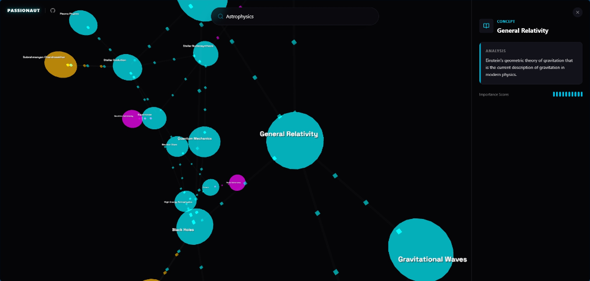

<p align="center">
  
</p>

# Passionaut 🌌 — Deep-Dive Passion Atlas

**Explore the universe of your passions with AI-generated interactive knowledge graphs.**

Passionaut is a visually overwhelming, highly complex interactive 3D knowledge graph built for the DEV.to Weekend Challenge (Passion Edition). It maps out any passion or domain (e.g., "Astrophysics", "Mechanical Keyboards", "Procedural Generation") into a concrete web of sub-disciplines, key projects, and techniques using Google's Gemini AI.

## 🖼️ Screenshots

<p align="center">
  
</p>
<p align="center">
  <em>The immersive dark-space HUD and search interface with suggestion chips and recent searches.</em>
</p>

<p align="center">
  
</p>
<p align="center">
  <em>An explorable, fully connected 3D constellation of astrophysics with dynamically scaled 3D labels.</em>
</p>

<p align="center">
  
</p>
<p align="center">
  <em>Deep-dive detail analysis panel displaying concept description and importance score.</em>
</p>

## 🚀 Features

- **AI Knowledge Mapping:** Uses Gemini 3.1 Flash-Lite to instantly generate structured, deep-dive data on any passion domain.
- **3D Atlas Visualization:** Renders the passion domain as an interactive, fully navigable 3D constellation using WebGL and `react-force-graph-3d`.
- **Dynamic 3D Typography:** Proportional, dynamically sized 3D labels floating in space next to nodes, ensuring zero text cutting or overlapping.
- **Deep-Space HUD:** A cinematic, high-end "WOW effect" UI built with React Spring and Tailwind CSS v4.
- **Interactive Audio Feedback:** Pure Web Audio API synthesized sci-fi sound effects (ticks on hover, D5 tone on click, sweeps on search).
- **Recent Searches & History:** Remembers your last 5 successful atlases locally so you can instantly switch back.
- **Shareable Links:** Click "Copy Share Link" to generate a URL with query parameters (e.g., `?q=Astrophysics`). When others open it, the app automatically loads and generates that specific atlas in real-time.
- **Serverless & Secure:** Fully static Next.js 16 app deployed on GitHub Pages. You bring your own Gemini API key (stored securely in your browser's local storage).

## 🛠️ Tech Stack

- **Framework:** Next.js 16 (App Router, Static Export)
- **UI & Styling:** React 19, Tailwind CSS v4, Lucide Icons
- **Animations:** `@react-spring/web`, `@react-spring/three`
- **3D Rendering:** `three.js`, `@react-three/fiber`, `react-force-graph-3d`
- **State Management:** `zustand` (with localStorage persistence)
- **AI Integration:** `@google/genai` (Gemini API, Structured JSON output)
- **Audio Synthesis:** Native browser Web Audio API (no external asset loading)

## 📦 Getting Started

### Prerequisites
- Node.js 20+
- pnpm
- A free Google Gemini API Key from [Google AI Studio](https://aistudio.google.com/apikey)

### Installation

1. Clone the repository:
   ```bash
   git clone https://github.com/johnnylemonny/passionaut.git
   cd passionaut
   ```

2. Install dependencies:
   ```bash
   pnpm install
   ```

3. Run the development server:
   ```bash
   pnpm dev
   ```

4. Open [http://localhost:3000](http://localhost:3000) with your browser. The app will prompt you for your Gemini API key.

## 🏆 DEV.to Weekend Challenge

This project was built for the **DEV.to Weekend Challenge: Passion Edition (July 2026)**. It utilizes the Google AI prize category by deeply integrating the Gemini API to structure complex data dynamically.

### Why Passionaut?
Passionaut answers: *"How deep does my passion go?"* It visualizes the sheer complexity and interconnectivity of any subject, transforming abstract passion into a concrete, explorable atlas.

## 📄 License

This project is licensed under the MIT License - see the [LICENSE](LICENSE) file for details.

---
*Created by [johnnylemonny](https://github.com/johnnylemonny)*
